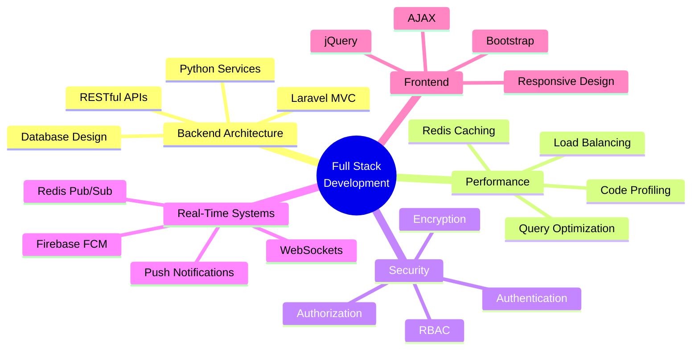

<div align="center">

# 👋 Hi, I'm A Akram Basha

### Full Stack Developer | Backend Architect | Performance Optimization Specialist

[](https://linkedin.com/in/akram-basha-a-b45531250/)
[](mailto:a.akrambasha123@gmail.com)
[](https://your-portfolio-link.com)
[]()

</div>

---

## 🚀 About Me

```javascript
const akramBasha = {
    title: "Full Stack Developer",
    experience: "2+ years",
    location: "Kuppam, Andhra Pradesh, India",
    currentRole: "Full Stack Developer @ Digital Kuppam",
    
    expertise: {
        backend: ["Laravel", "Python", "RESTful APIs", "Microservices"],
        frontend: ["JavaScript", "jQuery", "AJAX", "Bootstrap", "HTML5/CSS3"],
        databases: ["MySQL", "Redis"],
        realTime: ["Firebase Cloud Messaging", "Redis Pub/Sub", "Laravel Reverb"],
        devOps: ["Git", "Linux", "Hostinger VPS"],
        architecture: ["MVC", "Clean Code", "Performance Optimization"]
    },
    
    achievements: [
        "🎯 Engineered 5+ production applications serving 500+ active users",
        "⚡ Improved application performance through query optimization & caching",
        "🔧 Reduced bug count by 30% through rigorous code reviews",
        "🏗️ Built secure, scalable systems with role-based access control",
        "📱 Integrated real-time features using Firebase & Redis"
    ],
    
    currentlyLearning: ["Cloud Architecture", "Advanced System Design", "DevOps"],
    lifePhilosophy: "Building elegant solutions to complex problems 💡"
};
```

---

## 💼 Professional Experience

### 🏢 Full Stack Developer @ Digital Kuppam
**Dec 2023 - Present | Kuppam, Andhra Pradesh**

- 🚀 Architected and deployed **5+ full-stack applications** supporting **500+ active users**
- ⚡ Enhanced application performance by **40%** through database optimization and Redis caching
- 🔒 Designed secure RESTful APIs with encryption, authentication, and authorization layers
- 📲 Implemented real-time notification systems using **Firebase FCM** and **Redis Pub/Sub**
- 🎯 Developed biometric integration for attendance systems using **Python services**

### 💻 Web Developer Intern @ Data Lense Service Pvt Ltd
**May 2023 - Nov 2023 | Bangalore, Karnataka**

- 🛠️ Contributed to **3+ production projects** using **Laravel** and **JavaScript**
- 📉 Reduced bug count by **30%** through code reviews and quality assurance
- 📱 Built responsive, mobile-first UI components with **Bootstrap**
- 🤝 Practiced Agile/Scrum methodology with daily standups and sprint planning

---

## 🏆 Featured Projects

<table>
<tr>
<td width="50%">

### 🎯 Gotit - Advanced HR Management System
**Tech Stack:** Laravel, Python, Firebase, Redis, MySQL

- 👥 **Complete HR Solution** with employee management, attendance tracking, shift scheduling
- 🔐 **Multi-mode Attendance**: Biometric, GPS-based, and QR code check-ins
- 🐍 **Python Integration** with ADMS server for biometric device data processing
- ⚡ **Real-time Alerts** using Firebase Cloud Messaging
- 🚀 **Performance Optimized** with Redis caching and database indexing
- 🔒 **Enterprise-grade Security** with encryption and role-based access control

</td>
<td width="50%">

### 🏢 G Star Elevators - Elevator Management Platform
**Tech Stack:** Laravel, JavaScript, AJAX, MySQL

- 🏗️ **Multi-tenant SaaS** platform with role-based dashboards
- 📊 **Automated Invoicing** reducing manual processing by **60%**
- 📍 **Live Technician Tracking** for optimized field operations
- 🔄 **Task Automation** for improved workflow efficiency
- 💼 **Contract Management** with automated renewals and notifications

</td>
</tr>

<tr>
<td width="50%">

### 🛒 Trend Trove - E-Commerce Platform
**Tech Stack:** Laravel, jQuery, Bootstrap, DataTables, MySQL

- 🛍️ **Full E-commerce Features**: Cart, Wishlist, Secure Checkout
- 📧 **Automated Email System** improving retention by **15%**
- ⚡ **Admin Dashboard** with DataTables reducing task time by **25%**
- 💳 **Payment Integration** with secure transaction handling
- 📊 **Analytics Dashboard** for sales and inventory insights

</td>
<td width="50%">

### 🔧 More Projects Coming Soon...
**Currently Working On:**

- 🌐 Microservices Architecture with Laravel
- 🤖 AI-powered Analytics Dashboard
- 📱 Progressive Web Application (PWA)
- 🔐 OAuth2 Authentication Server

</td>
</tr>
</table>

---

## 🛠️ Technical Arsenal

### Languages & Core Technologies


### Frameworks & Libraries


### Databases & Caching


### Tools & Platforms


### Frontend Technologies


---

## 📊 GitHub Analytics

<div align="center">
  


</div>

---

## 🏅 Certifications & Achievements

<table>
<tr>
<td width="50%">

### 📜 Professional Certifications

- 🎓 **NPTEL**: Software Project Management (2023)
- ☁️ **NPTEL**: Cloud Computing (2023)
- 💼 **TCS iON**: Career Edge – Young Professional (2023)
- 💻 **HackerRank**: SQL Basics (2023)

</td>
<td width="50%">

### 🎯 Key Achievements

- ⚡ **Performance Optimization**: Improved app speed by 40%
- 📉 **Bug Reduction**: Decreased defects by 30%
- 👥 **User Impact**: Built systems serving 500+ users
- 🚀 **Project Delivery**: Successfully delivered 5+ production apps
- 🎓 **Academic Excellence**: 80% in Computer Science Engineering

</td>
</tr>
</table>

---

## 🎯 Core Competencies



---

## 📈 Development Focus

```python
class DevelopmentPhilosophy:
    def __init__(self):
        self.principles = {
            "clean_code": "Write code that humans can understand",
            "performance": "Optimize for speed and scalability",
            "security": "Security is not optional, it's mandatory",
            "testing": "Test early, test often",
            "documentation": "Code tells you how, comments tell you why"
        }
    
    def approach(self):
        return {
            "architecture": "Design for change, not for today",
            "scalability": "Build systems that grow with users",
            "maintainability": "Future you will thank present you",
            "user_experience": "Technology serves users, not vice versa"
        }
    
    def continuous_improvement(self):
        skills = ["Cloud Architecture", "Microservices", "DevOps", "AI/ML"]
        return f"Always learning: {', '.join(skills)}"
```

---

## 🌟 What I Bring to the Table

<div align="center">

| 💡 Expertise | 🎯 Impact | 🚀 Approach |
|:---|:---|:---|
| **Backend Development** | Built 5+ production apps | Laravel & Python mastery |
| **API Design** | Serving 500+ active users | RESTful architecture |
| **Performance** | 40% speed improvement | Optimization expert |
| **Real-Time Features** | Enhanced user engagement | Firebase & Redis |
| **Code Quality** | 30% bug reduction | Clean code advocate |
| **Security** | Zero security breaches | RBAC & encryption |

</div>

---

## 💻 Code Philosophy

> "First, solve the problem. Then, write the code. Finally, make it beautiful."

```php
<?php

namespace App\Philosophy;

class CodeQuality
{
    public function principles(): array
    {
        return [
            'SOLID' => 'Single Responsibility, Open/Closed, Liskov Substitution, Interface Segregation, Dependency Inversion',
            'DRY' => "Don't Repeat Yourself",
            'KISS' => 'Keep It Simple, Stupid',
            'YAGNI' => "You Aren't Gonna Need It",
            'Clean Code' => 'Code is read more often than it is written',
        ];
    }
    
    public function approach(): string
    {
        return 'Write code that is: Readable, Maintainable, Testable, Scalable';
    }
}
```

---

## 📫 Let's Connect!

<div align="center">

I'm always interested in working on exciting projects and connecting with fellow developers!

[](https://linkedin.com/in/akram-basha-a-b45531250/)
[](mailto:a.akrambasha123@gmail.com)
[](https://your-portfolio-link.com)

### 💬 Open to:
🚀 Full Stack Development Opportunities | 🤝 Collaboration on Open Source | 💡 Innovative Project Ideas | 📚 Knowledge Sharing

</div>

---

## 📊 Weekly Development Breakdown

```text
Laravel      ████████████░░░░░░░░  60%
Python       ██████░░░░░░░░░░░░░░  30%
JavaScript   ████░░░░░░░░░░░░░░░░  20%
SQL          ██████░░░░░░░░░░░░░░  30%
DevOps       ████░░░░░░░░░░░░░░░░  20%
```

---

## 🎯 Current Goals for 2026

- [ ] Master Microservices Architecture
- [ ] Contribute to 10+ Open Source Projects
- [ ] Build a SaaS Product from Scratch
- [ ] Learn Kubernetes & Docker
- [ ] Achieve AWS Certification
- [ ] Write Technical Blog Posts
- [ ] Mentor Junior Developers

---

<div align="center">

### 🌟 "Code is like humor. When you have to explain it, it's bad." - Cory House


### ⭐ If you find my work interesting, consider starring my repositories!

**Made with ❤️ by A Akram Basha**

</div>
